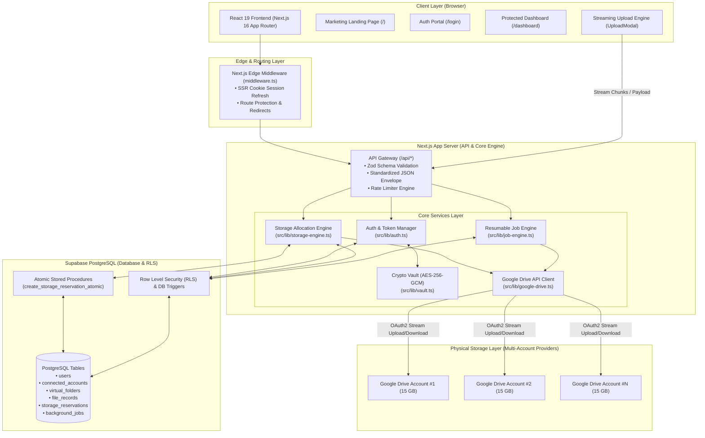
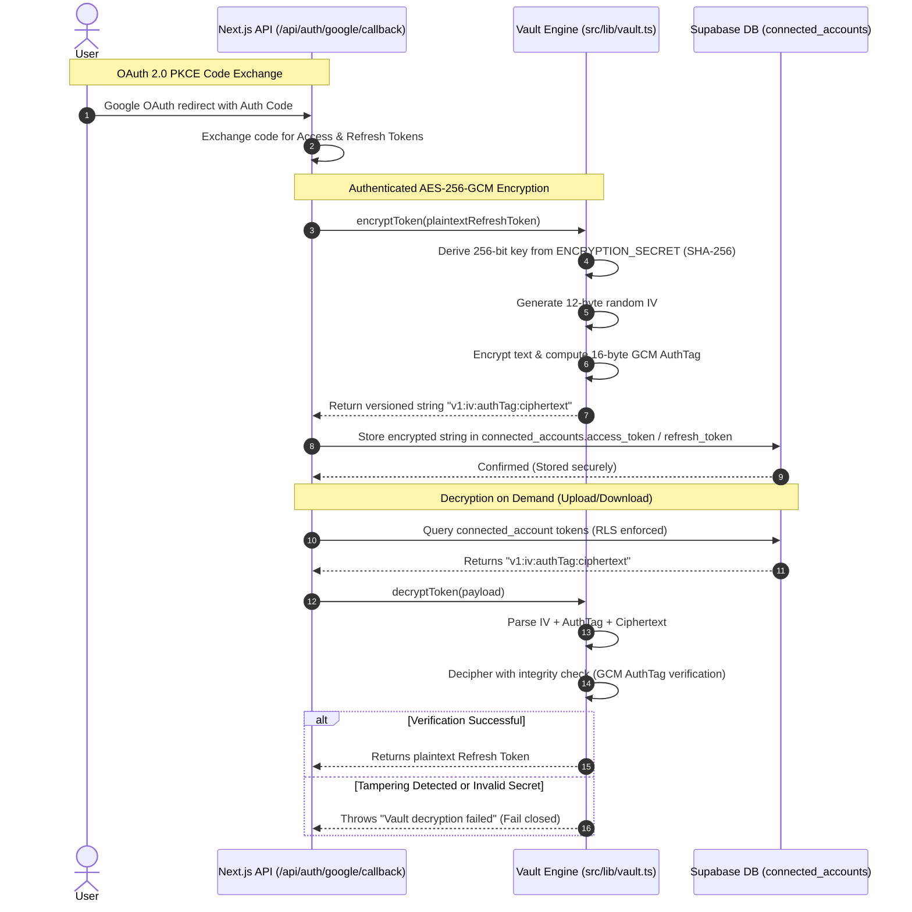
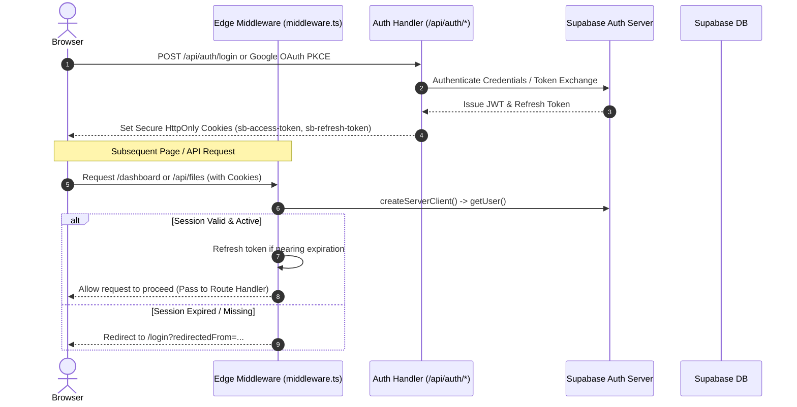
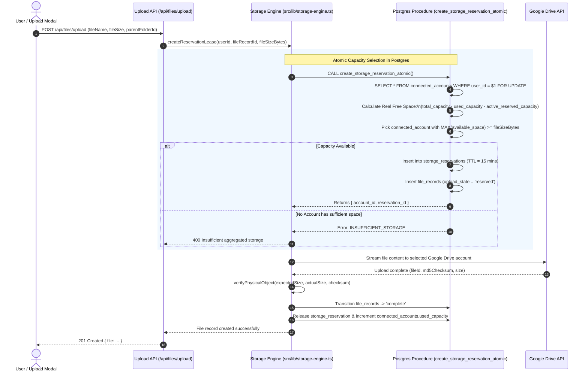
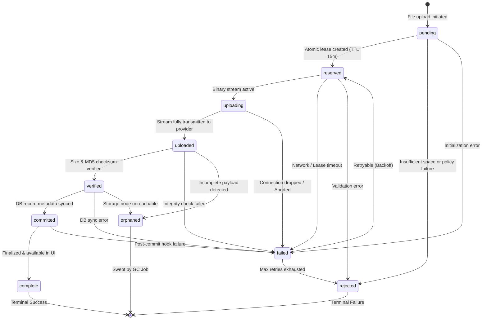
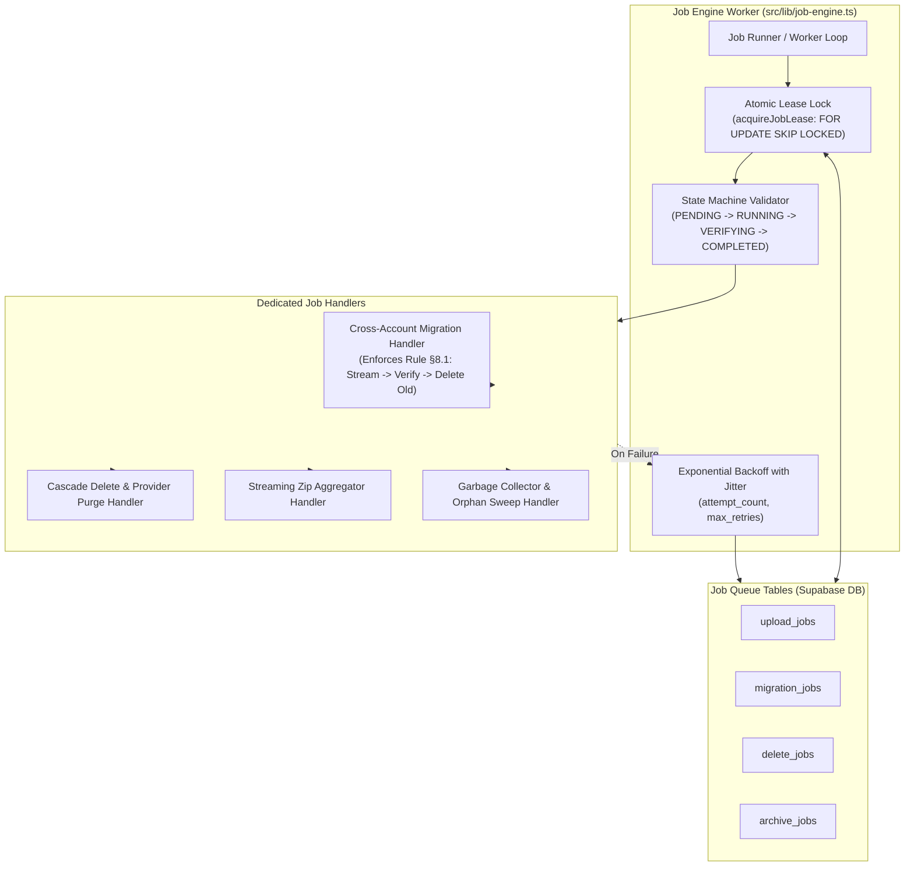
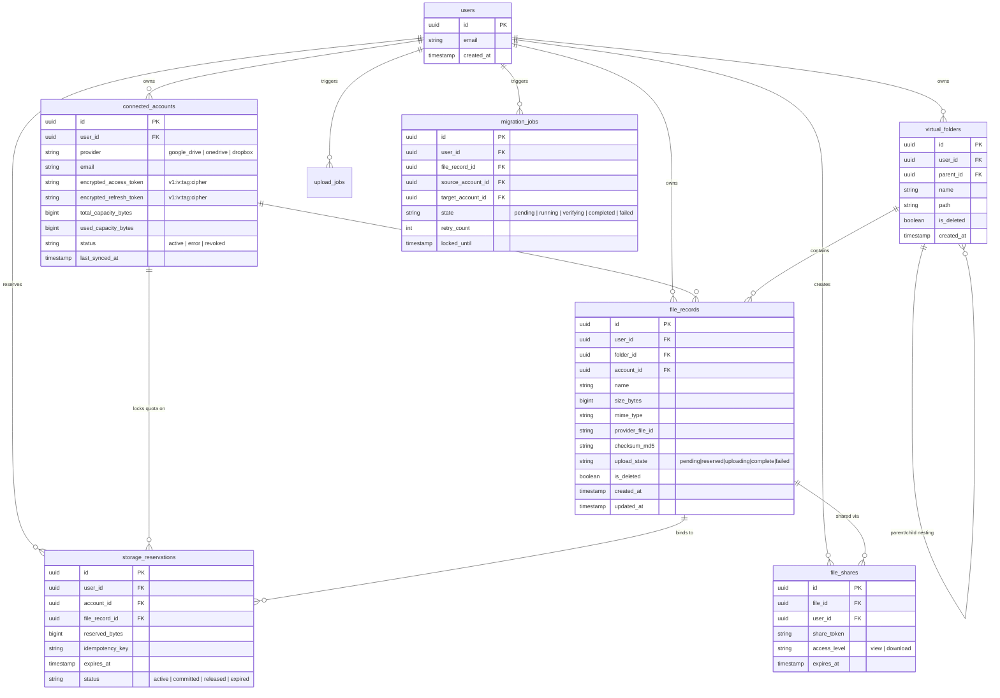

# 📐 MultiDrive Architecture & System Design Specification

This document details the complete end-to-end architecture, data flows, security boundaries, and database entity relationships for **MultiDrive** — a unified multi-cloud storage aggregator with atomic capacity allocation and zero-fragmentation storage paradigm.

---

## 📑 Table of Contents

1. [High-Level System Architecture](#1-high-level-system-architecture)
2. [Security & Vault Architecture](#2-security--vault-architecture)
3. [Authentication & Session Flow](#3-authentication--session-flow)
4. [Storage Engine & Capacity Selection](#4-storage-engine--capacity-selection)
5. [Upload & File Lifecycle State Machine](#5-upload--file-lifecycle-state-machine)
6. [Asynchronous Background Job Engine](#6-asynchronous-background-job-engine)
7. [Database Schema & Entity Relationship Diagram (ERD)](#7-database-schema--entity-relationship-diagram-erd)
8. [API & Security Boundary Matrix](#8-api--security-boundary-matrix)

---

## 1. High-Level System Architecture

MultiDrive aggregates multiple third-party cloud storage accounts (e.g. Google Drive, OneDrive, Dropbox) into a single virtual filesystem. It enforces a strict **1:1 logical-to-physical object mapping** (no file splitting or chunk metadata overhead) and balances uploads dynamically based on real-time account capacity.

---

## 2. Security & Vault Architecture

Sensitive OAuth2 refresh tokens and provider secrets are never stored in plaintext. They are encrypted using authenticated **AES-256-GCM** with a dynamic 12-byte initialization vector (IV) and a 16-byte authentication tag.

---

## 3. Authentication & Session Flow

MultiDrive leverages `@supabase/ssr` with HttpOnly cookies, validated across both Edge Middleware and API routes.

---

## 4. Storage Engine & Capacity Selection

To prevent race conditions and quota over-subscriptions during concurrent uploads, MultiDrive implements an **Atomic Capacity Selection & Reservation** system using Postgres row-level locks (`FOR UPDATE`).

---

## 5. Upload & File Lifecycle State Machine

Each file upload is strictly governed by a deterministic state machine (§5.1). Illegal state jumps are rejected immediately to prevent orphaned or partially written files.

---

## 6. Asynchronous Background Job Engine

Heavy operations (large cross-account migrations, bulk deletions, zip archiving, and periodic reconciliation sweeps) run asynchronously via a robust, leasing-based job queue.

---

## 7. Database Schema & Entity Relationship Diagram (ERD)

---

## 8. API & Security Boundary Matrix

| Component / Layer | Access Method | Security & Authorization Policy |
| :--- | :--- | :--- |
| **Frontend UI Pages** | Next.js Server Components / SSR | Edge Middleware checks Supabase session cookies; redirects unauthenticated users to `/login`. |
| **Public API Endpoints** | `GET /api/share/[token]` | Rate-limited public token lookup with expiration and access-level checks. |
| **Protected API Endpoints** | `/api/files/*`, `/api/folders/*`, `/api/accounts/*` | SSR Cookie Auth + Zod Request Validation + Application-level ownership checks (`user_id = auth.uid()`). |
| **Service Role Boundary** | `src/lib/supabase/server.ts` (Admin Client) | Restricted strictly to background tasks, atomic stored procedure invocations, and system reconciliation sweeps. |
| **Database Tables** | Supabase PostgreSQL | Protected by **Row Level Security (RLS)** ensuring users cannot query or mutate records belonging to other `auth.uid()`s. |
| **Provider OAuth Tokens** | Database `connected_accounts` | Stored exclusively as **AES-256-GCM** versioned ciphertexts. Decrypted only in memory during active API requests. |
